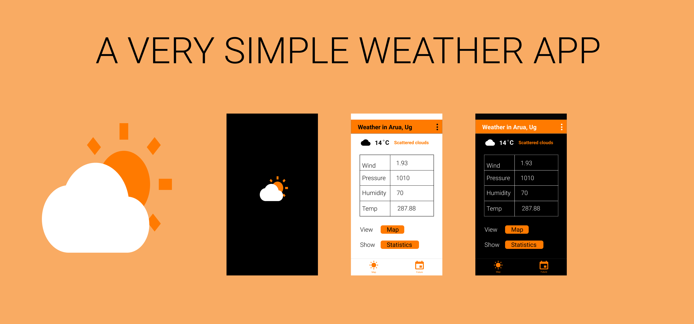

# Weather


## About
A simple weather app demonstrating the MVVM kotlin, Android Jetpack components and kodein, to fetch data from the server and display in the app using the retrofit library.

## Built With 🛠
- [Kotlin](https://kotlinlang.org/) - First class and official programming language for Android development.
- [ViewBinding](https://developer.android.com/topic/libraries/view-binding) - Generates a binding class for each XML layout file present in that module and allows you to more easily write code that interacts with views.
- [Retrofit](https://square.github.io/retrofit/) - A type-safe HTTP client for Android and Java.
- [Kodein](https://kodein.org/di/) - Kodein is a very simple and yet very useful pure Kotlin dependency retrieval container.
               It is very easy to use and configure.
- [Room](https://developer.android.com/topic/libraries/architecture/room?gclid=CjwKCAjwwMn1BRAUEiwAZ_jnEgolz5twQ8VDcXxXd3v6ADuBkkrJ6jvOISrlPYxMTOeUiVo-WOpnuhoCZTAQAvD_BwE&gclsrc=aw.ds) - The Room persistence library provides an abstraction layer over SQLite to allow for more robust database access while harnessing the full power of SQLite.
- [Glide](https://github.com/bumptech/glide) - Glide is a fast and efficient open source media management and image loading framework for Android that wraps media decoding, memory and disk caching, and resource pooling into a simple and easy to use interface.

## TODO
- Update README.MD WITH MORE DETAILS
- Add the forecast weather functionality.

## Credit
This project is built along side watching and learning from Tutorials of [Resocoder](https://www.youtube.com/watch?v=yDaaM3u389I&list=PLB6lc7nQ1n4jTLDyU2muTBo8xk0dg0D_w&index=1).
It has shown me how parts of the MVVM architecture fit and work together.
Its simple to understand and his explanations are nice and clear.
I highly recommend it for learning how to implement clean MVVM architecture.

## Contact
If you need any help, you can connect with me.
Visit:- [maku](https://www.linkedin.com/in/maku-mazakpe-700a3a165/)

## License
```
MIT License

Copyright (c) 2020 Maku Pauline Mazakpe

Permission is hereby granted, free of charge, to any person obtaining a copy
of this software and associated documentation files (the "Software"), to deal
in the Software without restriction, including without limitation the rights
to use, copy, modify, merge, publish, distribute, sublicense, and/or sell
copies of the Software, and to permit persons to whom the Software is
furnished to do so, subject to the following conditions:

The above copyright notice and this permission notice shall be included in all
copies or substantial portions of the Software.

THE SOFTWARE IS PROVIDED "AS IS", WITHOUT WARRANTY OF ANY KIND, EXPRESS OR
IMPLIED, INCLUDING BUT NOT LIMITED TO THE WARRANTIES OF MERCHANTABILITY,
FITNESS FOR A PARTICULAR PURPOSE AND NONINFRINGEMENT. IN NO EVENT SHALL THE
AUTHORS OR COPYRIGHT HOLDERS BE LIABLE FOR ANY CLAIM, DAMAGES OR OTHER
LIABILITY, WHETHER IN AN ACTION OF CONTRACT, TORT OR OTHERWISE, ARISING FROM,
OUT OF OR IN CONNECTION WITH THE SOFTWARE OR THE USE OR OTHER DEALINGS IN THE
SOFTWARE.
```
